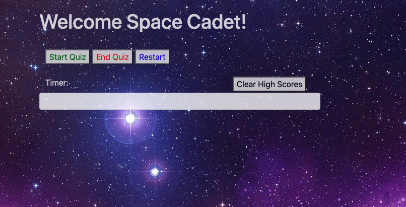
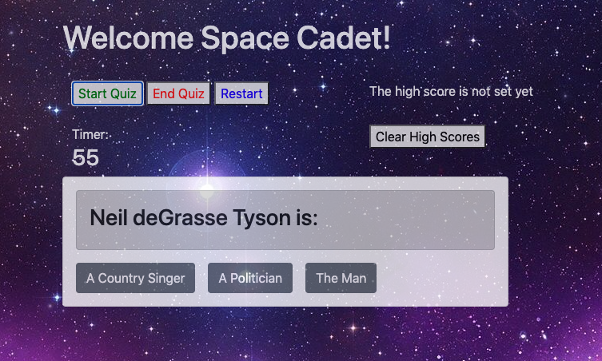
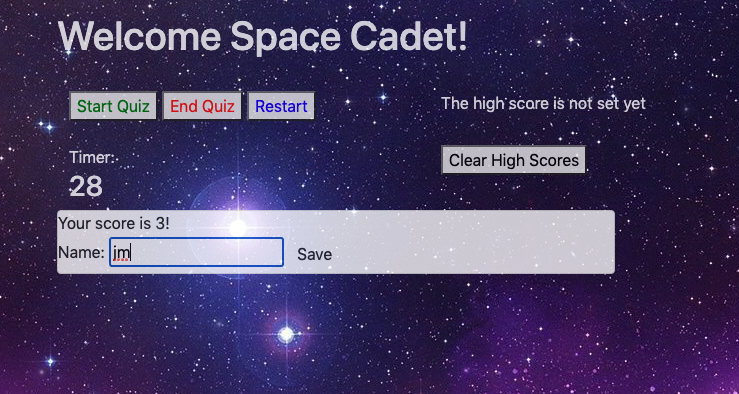
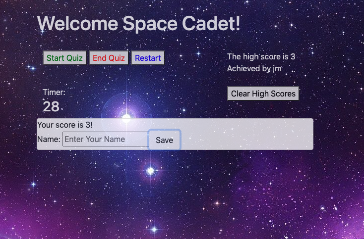

# homework4
created by: John Murphy 

This is a simple quiz for exploring space and java-script!
Users may save their highscore in local memory. 
Correct answers will earn you a point while an incorrect answer will deduct 10 seconds from remaining time. 

io link: https://jmurphy0.github.io/homework4/
github link: https://github.com/jmurphy0/homework4.git